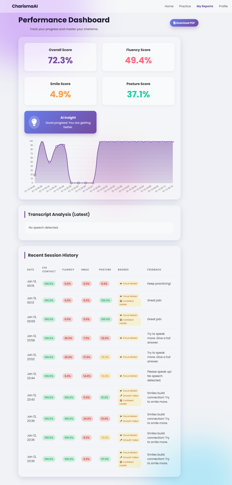
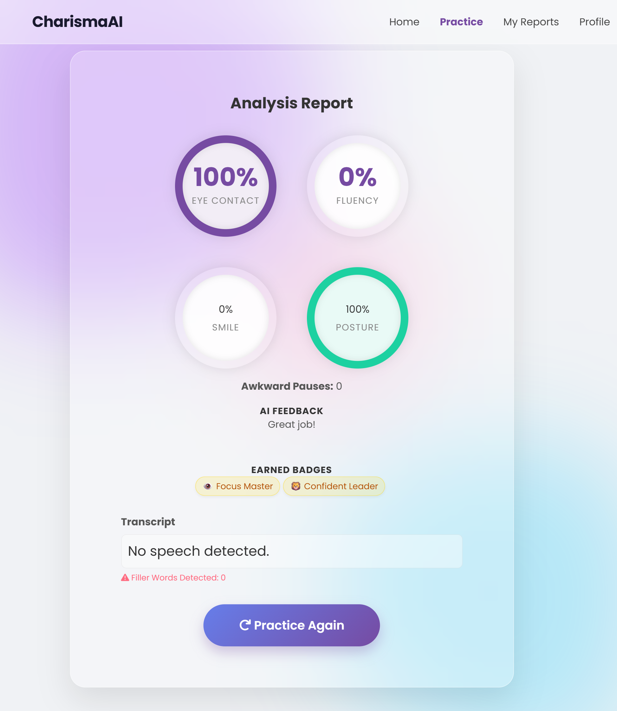
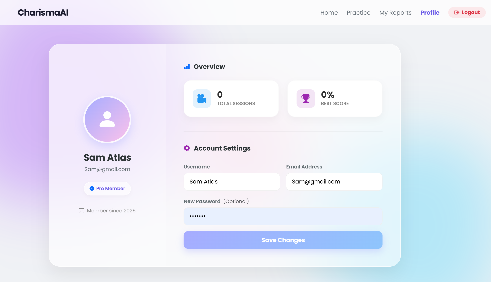
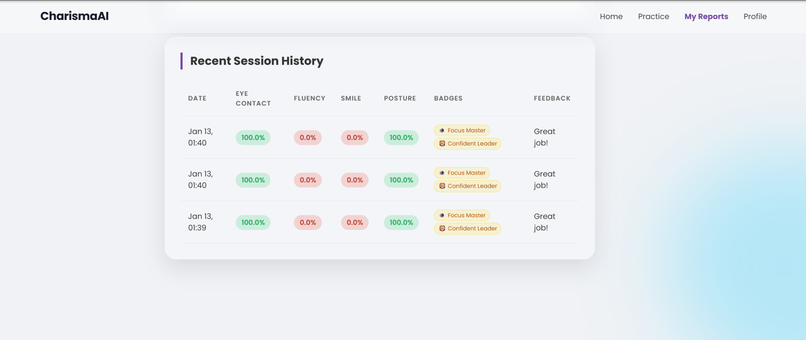

# 🚀 CharismaAI - Your Personal AI Communication Coach


**CharismaAI** is an advanced AI-powered SaaS application designed to help students and professionals improve their presentation and communication skills. It utilizes a hybrid architecture of **Java Spring Boot** (Backend) and **Python** (AI Engine) to analyze video inputs for Eye Contact, Fluency, Smile, and Posture in real-time.

---

## 📸 Screenshots

| Dashboard & Stats | AI Analysis Report |
|:-----------------:|:------------------:|
|  |  |

| User Profile | Gamification Badges |
|:------------:|:-------------------:|
|  |  |

---

## ✨ Key Features

### 🧠 AI-Powered Video Analysis
* **👁️ Eye Contact Tracking:** Uses **MediaPipe Face Mesh** to track iris movement and calculate focus percentage.
* **😊 Emotion Detection:** Analyzes facial landmarks to detect smiles and approachability.
* **🦁 Posture Analysis:** Monitors head orientation to ensure confident body language.
* **🎤 Fluency & Filler Words:** Uses **Google Speech Recognition** to transcribe audio, detect pauses, and count filler words (um, ah, like).

### 📊 Reporting & Analytics
* **Detailed Scorecards:** Breaks down performance into 4 key metrics.
* **Visual Graphs:** Charts.js integration to track progress over time.
* **PDF Export:** Generate downloadable performance reports for interviews.

### 🎮 Gamification & User System
* **Badges System:** Earn badges like "Focus Master", "Smooth Talker", and "Charisma Legend".
* **Secure Auth:** Full Login/Registration system with encrypted passwords.
* **Profile Dashboard:** Track total sessions and personal best scores.

---

## 🚀 Installation & Setup

### Prerequisites
* Java JDK 17+
* Python 3.8+
* MySQL Server
* Maven

### Step 1: Clone the Repo
```bash
git clone https://github.com/YourUsername/CharismaAI.git
cd CharismaAI
```

### Step 2: Configure Database
Open `src/main/resources/application.properties` and update your MySQL credentials:

```properties
spring.datasource.url=jdbc:mysql://localhost:3306/charisma_db
spring.datasource.username=root
spring.datasource.password=your_password
```

### Step 3: Install Python Dependencies
Navigate to the project root and install the required AI libraries:

```bash
pip install opencv-python mediapipe speechrecognition moviepy numpy
```

### Step 4: Run the Application
You can run the Spring Boot app using Maven:

```bash
mvn spring-boot:run
```

The application will start at: `http://localhost:8081`

---

## 👨‍💻 Author

**Kavindu**  
Full Stack Developer & AI Enthusiast  
Sri Lanka 🇱🇰

<p align="center"> Made with ❤️ using Java & Python </p>
